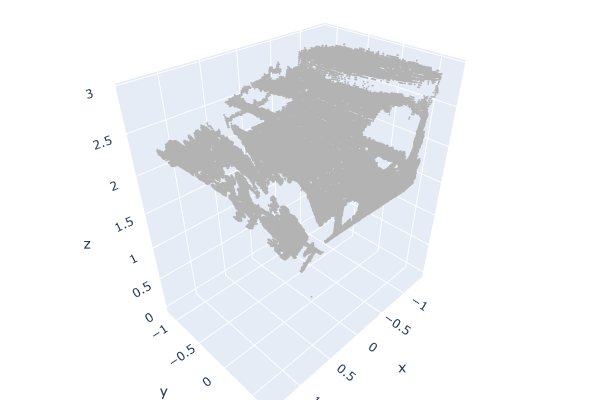
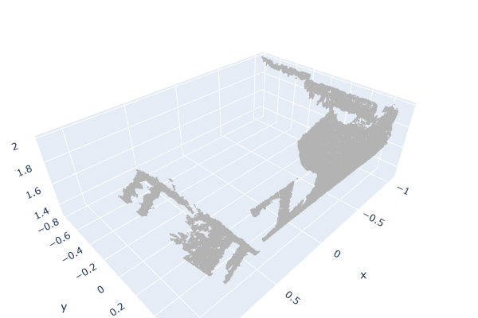
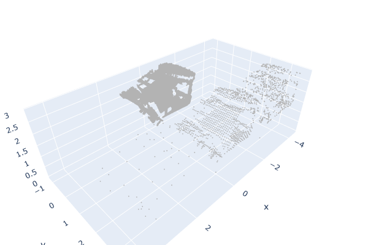
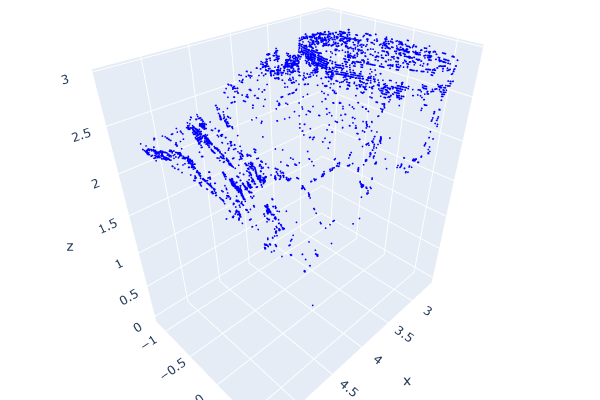
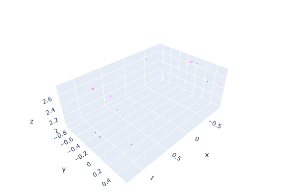
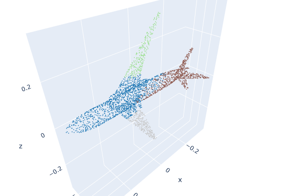

# PointCloudsManipulationSegmentation
Welcome to my PointClouds Filtering and Segmentation repository! This repository contains two projects aimed at processing and analyzing point clouds, which are essential in various fields such as computer vision, robotics, and environmental scanning.

## About Point clouds:
Point Clouds play a crucial role in various fields, and their manipulation and segmentation are essential tasks for extracting meaningful information.
In computer vision applications, point clouds are fundamental for tasks such as 3D object recognition, scene understanding, and reconstruction. 

Robotics heavily relies on point cloud data for tasks like simultaneous localization and mapping (SLAM), obstacle avoidance, and path planning. Efficient manipulation and segmentation of point clouds enable robots to navigate and interact with their environment effectively.

Point clouds are also widely used in environmental scanning, including applications like LiDAR (Light Detection and Ranging). This technology is crucial for mapping terrain, monitoring forests, and assessing the impact of natural disasters. 

## Built with:
   
      

## PointCloudsFiltering.ipynb:
The PointClouds Filtering project by is designed to provide a set of tools and algorithms for filtering and cleaning point cloud data. 
Point clouds are often noisy or contain outliers, making it challenging to work with them effectively.

* Example Original Object :

    

* Filtered Object:

    

* Downsampled Object:

    

* Statistical Ourlier Removal Filter:

    

* Radial Outlier Removal Filter:

    

**Features**
* Noise Reduction: Remove noise from point cloud data to improve the quality and accuracy of subsequent processing steps.
* Outlier Detection: Identify and remove outlier points that do not belong to the main structure of the point cloud.
* Downsampling: Reduce the point cloud density while preserving critical information, making it more manageable.
**Getting Started**
To get started with the PointClouds Filtering project, please refer to the project-specific notebook for detailed instructions on how to set up and use the filtering tools.

## PointCloudsSegmentation.ipynb:

The PointClouds Segmentation project focuses on segmenting point clouds into meaningful parts or objects. Segmentation is crucial for various applications, such as object recognition, scene understanding, and autonomous navigation, as it allows you to extract valuable information from a point cloud dataset.

* In this instance, I traine kmeans and dbscan for segmenting parts of an airplane.
* The idea was to be able to successfuly segment an airplane point cloud object into its 4 main parts: body, wings, tail and head.
* A sample of The result of kmeans is :
    
    
    

**Features**
* Object Detection: Identify and separate individual objects within the point cloud for object recognition tasks.
* Color-Based Segmentation: Utilize color information to segment point clouds based on object color.

**Run Code:**

* Clone Repository
* Download ShapenNet Dataset using the provided script or using the notebook respective cells.
    ~~~
    python download_dataset.py
    ~~~
* Install dependencies
* Run the notebook preferably in google colab by changing resource to T4 GPU.

## Contact:
Let's connect and explore how my skills and expertise in Machine Learning & Image Processing fit your team.
 Feel free to reach out to me on LinkedIn or through email & don't forget to visit my portfolio.
 
  
  
  
